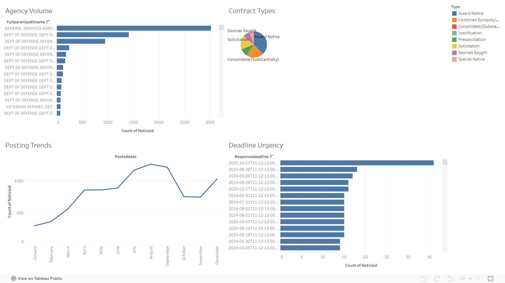

# Federal Contract Intelligence Dashboard

End-to-end data pipeline that ingests federal procurement data from the SAM.gov API into PostgreSQL and surfaces agency spending trends and procurement opportunities through an interactive Tableau Public dashboard.

## Overview

This project pulls live procurement records from the U.S. federal government's SAM.gov API, loads them into a local PostgreSQL database, and exposes the data through a Tableau dashboard designed for procurement market research. The goal is to make it easy to spot which agencies are actively spending in which categories, where procurement opportunities are concentrated, and how spending patterns shift over time.

# Key Findings

The dashboard surfaces four main patterns in federal contract opportunity data:

- Agency activity is concentrated. A relatively small set of federal agencies post the majority of contract opportunities captured in the dataset, while many others post infrequently. This concentration matters for vendors trying to prioritize where to focus their business development efforts, since chasing every agency is rarely realistic.
- Contract types follow predictable patterns. Visualizing the breakdown by contract type reveals which procurement vehicles agencies rely on most often, including the balance between competitive solicitations and other award types. Understanding this mix helps vendors calibrate which kinds of opportunities they are most likely to encounter.
- Posting volume varies meaningfully across the year. The data shows clear seasonality in when agencies post new opportunities, with certain months consistently busier than others. This pattern reflects the federal budget cycle and gives vendors useful context for when to expect peaks and troughs in solicitation activity.
- Response deadlines cluster around specific dates. Mapping due dates against posting dates shows how much lead time vendors typically receive, and how many opportunities cluster around the same response windows. This visibility into the deadline distribution is useful for capacity planning, especially for smaller vendors with limited bid resources.

## Tech Stack

- **Python** (pandas, requests, psycopg2) for ingestion and transformation
- **PostgreSQL** for storage and SQL-based analysis
- **Tableau Public** for visualization
- **python-dotenv** for credential management

## Architecture

1. `ingest.py` authenticates against the SAM.gov API, paginates through procurement records, and loads them into a local Postgres database.
2. `export.py` queries the database and produces a flat file consumable by Tableau.
3. The Tableau dashboard visualizes agency spending trends, category concentration, and procurement activity.

## Live Dashboard

[View on Tableau Public](https://public.tableau.com/app/profile/john.henry.marcinak/viz/FederalContractIntelligenceDashboard/FederalContractIntelligenceDashboard)

## Setup

### Prerequisites

- Python 3.10+
- PostgreSQL 15+ running locally
- A SAM.gov API key ([request one here](https://sam.gov/))

### Installation

1. Clone the repo and navigate into the folder:

git clone https://github.com/marcinakjh/federal-contract-intelligence.git
cd federal-contract-intelligence

2. Create and activate a virtual environment:

py -m venv venv
venv\Scripts\activate

3. Install dependencies:

pip install -r requirements.txt

4. Copy `.env.example` to `.env` and fill in your values:

copy .env.example .env

Then open `.env` and replace each placeholder with your actual SAM.gov API key and PostgreSQL credentials.

### Running the Pipeline

Fetch fresh data from SAM.gov and load to Postgres:

Export the data for Tableau:

## Project Structure

federal-contract-intelligence/
├── ingest.py              # Pulls data from SAM.gov into Postgres
├── export.py              # Queries Postgres for Tableau consumption
├── requirements.txt       # Python dependencies
├── .env.example           # Template for local credentials
├── .gitignore
├── screenshots/
│   └── dashboard.png
└── README.md

## Author

John Henry Marcinak
B.S.B.A. in Data Analytics, The Catholic University of America
